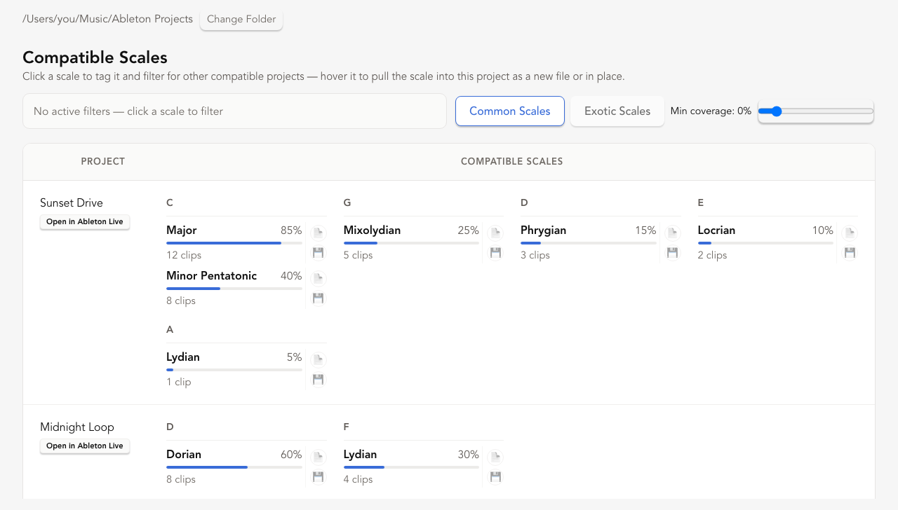

<p align="center">
  
</p>

<p align="center">
  A maelstrom of <code>.als</code> files, tamed. Scan a folder of Ableton
  Live Sets, see what musical scale every project and clip is compatible
  with, and filter your whole library by key.
</p>

<p align="center">
  
  
  
</p>

<p align="center">
  
</p>

## What it does

Point it at a folder of `.als` files and it will:

- **Scan** the directory (top-level only, not subfolders) and list every
  project in a filterable, virtualized table.
- **Read** each project's explicit `ScaleInformation` key/scale tags where
  present.
- **Infer** compatible scales directly from MIDI clip note content when a
  project has no explicit scale set.
- **Filter** the whole list by scale, so you can answer "which of my
  projects are in D Dorian?" in one click.
- **Apply** a chosen scale back to a project, tagging every MIDI clip that's
  compatible with it.

## Status

This is early — v0.1, unreleased. What's solid vs. what's still missing:

**Works today**
- Directory scanning + virtualized/filterable project table
- Explicit `ScaleInformation` parsing
- Scale inference from MIDI clip content
- Filter-by-scale UI
- Applying a scale to a project, writing it onto every compatible MIDI clip

**Not yet**
- No packaged release — run from source (below)
- Near-matches (a clip one or two notes off from a scale) aren't detected;
  only exact pitch-class matches count

## Getting started

Developed and tested on macOS only. Windows/Linux aren't supported — PRs
welcome if you want to make it work there.

### Prerequisites

- [Rust toolchain](https://www.rust-lang.org/tools/install) (stable)
- [Node.js](https://nodejs.org/) and [pnpm](https://pnpm.io/)
- Xcode Command Line Tools — see the
  [Tauri macOS prerequisites](https://v2.tauri.app/start/prerequisites/#macos)

### Run it

```sh
pnpm install
pnpm tauri dev
```

### Build it

```sh
pnpm tauri build
```

### Test it

```sh
cargo test       # from src-tauri/ — Rust unit tests
pnpm test        # vitest — frontend unit tests
pnpm test:e2e    # playwright — end-to-end UI tests
```

## How it works

The `.als` parsing and scale-scoring logic lives in `src-tauri/src/als/` —
see its [README](src-tauri/src/als/README.md) for how scale information is
extracted from a project and how scale candidates are scored.

## Roadmap

- [x] Scan MIDI clips in a project and determine every scale they're
      compatible with
- [x] Surface scale compatibility in the UI, filterable/sortable per project
- [x] Apply a scale to a project's compatible MIDI clips
- [ ] Detect near-matches (a clip that fits a scale except for one or two
      notes)
- [ ] Packaged builds / releases
- [ ] Categorize a project's tracks (DRUMS, BASS, PERCUSSION, VOCALS, ...)
      from their names, so contents can be presented coherently — see
- [ ] **Mashup**: filter projects down to a shared scale, select several of
      them, and get a picker of elements to pull from each into one new

## License

[MIT](LICENSE.md)
